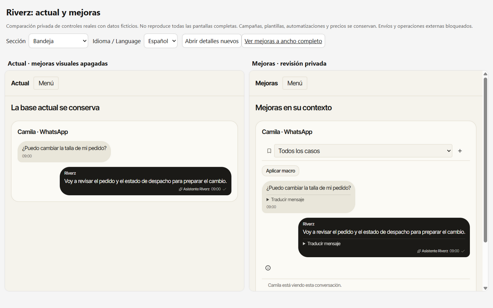
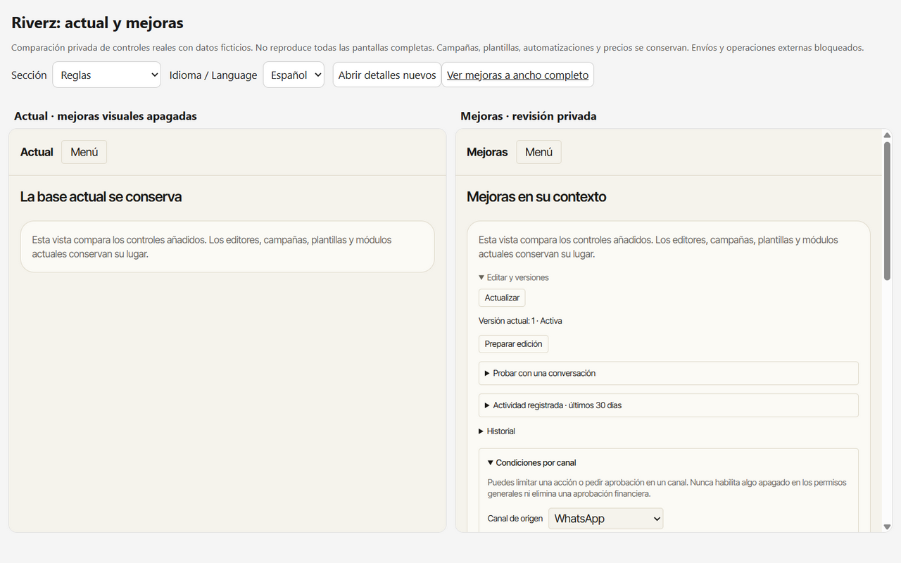
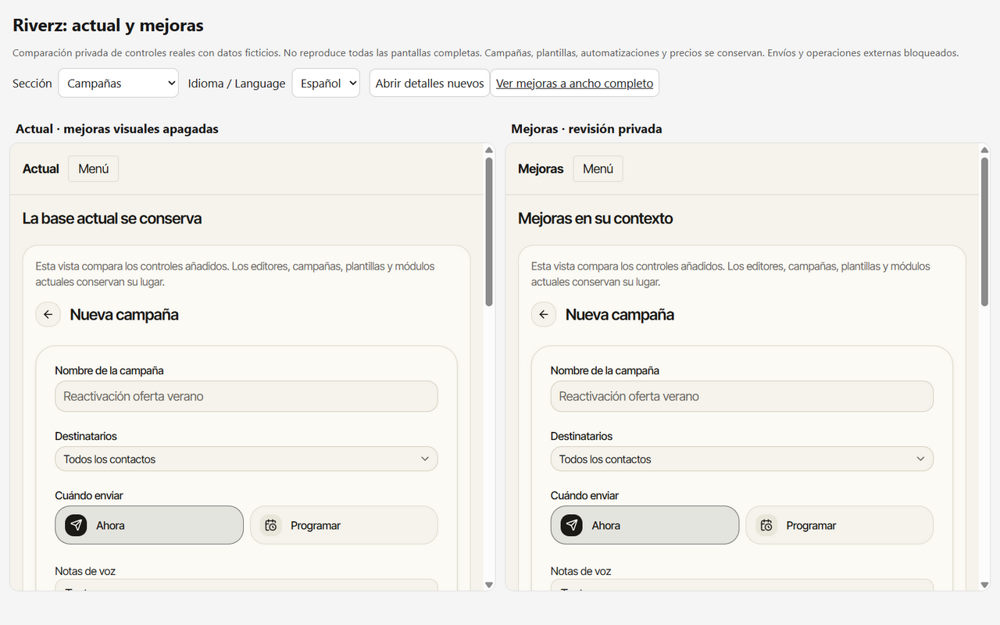
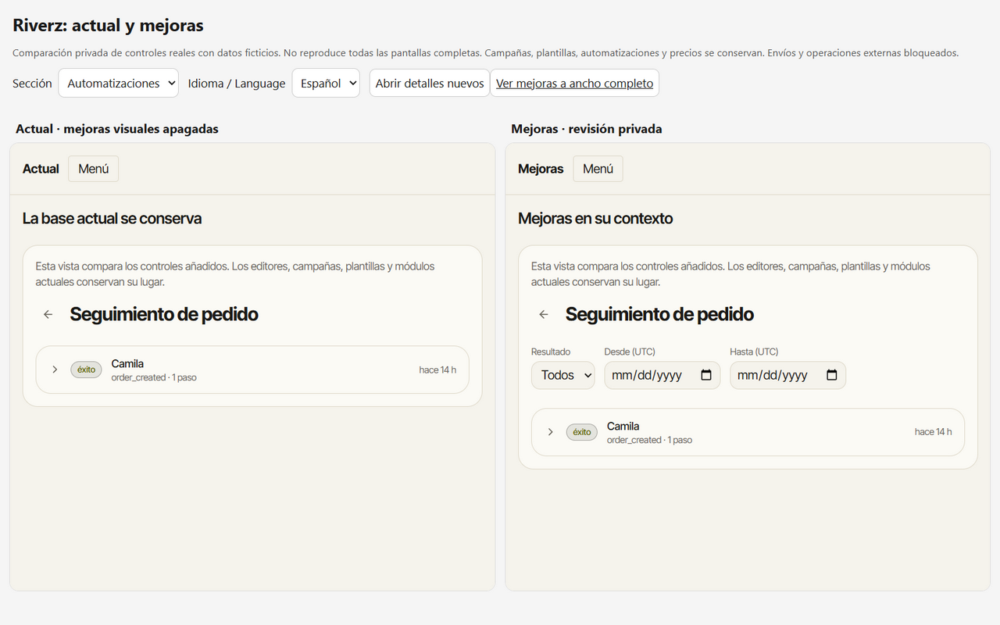

# Comparación privada de Riverz

La comparación conserva el posicionamiento de un superasistente preparado para cada negocio y los módulos vigentes. Usa componentes reales del repositorio con fixtures ficticios. No inicia una sesión comercial, carga credenciales, envía mensajes, llama modelos, cambia pedidos ni cobra dinero.

La [matriz de aceptación](commslayer-acceptance-matrix.md) y la [preparación de proveedores](commslayer-provider-readiness.md) distinguen construcción, publicación de código y comprobaciones externas.

## Abrir y comparar

1. Completar la compilación validada en `.b2-validation-0930`. El arnés reutiliza su CSS y fuentes; no sustituye el diseño por una maqueta nueva.
2. Desde el repositorio, ejecutar `node scripts/comparison/build.mjs`.
3. Ejecutar `node scripts/comparison/serve.mjs` y abrir `http://127.0.0.1:3107/compare?locale=es&page=inbox` para las dos variantes lado a lado. La vista individual está en `http://127.0.0.1:3107/?stage=current&locale=es&page=inbox`.
4. Usar **Versión actual / Mejoras** sobre la misma pestaña y sección. Cambiar ES/EN y el ancho del dispositivo conserva el contexto de comparación.
5. Ejecutar `node scripts/comparison/check.mjs` para comprobar el aislamiento del servidor y del bundle.

El servidor escucha únicamente en loopback. El navegador de esta tarea permanece invisible hasta entregar la comparación; no se configura `NEXT_PUBLIC_RIVERZ_UI_STAGE` en Render. Las escrituras de los ejemplos que admiten edición solo viven en memoria local y se reinician al navegar. Las operaciones externas y la generación de IA están bloqueadas con un error explícito, no simuladas como éxitos reales.

## Qué se puede revisar

| Sección | Controles reales incluidos |
| --- | --- |
| Bandeja | Mensajes, notas/presencia, vistas guardadas, acciones masivas, seguimiento/macros, respuestas internas del caso, comprensión/exportación, disposición/bloqueo, equipo/capacidad y evidencia de turnos/reglas/documentos. |
| Reglas | Versiones, borrador, prueba individual, actividad/evaluaciones y restricciones de herramientas por canal. |
| Documentos | Importación, revisión, activación/retirada, historial y conexión de Drive. |
| Reportes | Casos con revisión vigente, tiempos y CSV; motivos, satisfacción y evidencia filtrada. |
| Flujos | Cohorte, estados, entradas por nodo, casos y exportación. |
| Postventa | Política por producto, historial del expediente y guía/recepción declaradas. |
| Pedidos | Siete acciones soportadas y solicitudes de dirección, con revisión previa. |
| HTTP | Configuración del sistema propio y formularios existentes. |
| Plantillas | Texto editable y acceso al borrador asistido. |
| Campañas | Constructor vigente con audiencia, horario, plantillas, voz, variables y costes. |
| Automatizaciones | Historial vigente con filtros nuevos y recorrido por pasos. |
| Móvil | Instalación y avisos voluntarios del dispositivo. |
| Lanzamiento | Seis demostraciones ilustrativas, ejemplos por negocio, pricing con fecha, fichas y changelog preparado. |

## Límites de la comparación

Es un catálogo interactivo de controles añadidos, no una copia íntegra de todas las pantallas del CRM. Campañas y registros de automatización usan su pantalla real; otros apartados presentan los componentes nuevos en contexto. La columna actual conserva el menú y la base mostrada, pero no sustituye una sesión autenticada de producción. Un módulo no reproducido informa esa limitación; nunca aparece como una función eliminada de Riverz.

Los datos son ficticios y explícitos. Una reserva particular no se presenta como regla global; una devolución abierta no representa dinero devuelto. La evaluación humana de una regla no prueba causalidad y un tiempo hasta revisión no representa resolución automática. Las fuentes o resultados de proveedores solo pueden declararse verificados con evidencia del entorno correspondiente.

Las capturas y resultados de QA se guardan aparte. No existe ruta pública de comparación, cambio de pricing, rediseño del menú ni dependencia de n8n/Make. Los cambios de fiabilidad ya publicados se encuentran en ambas variantes: **Actual** significa las mejoras visuales apagadas, no una recreación de errores antiguos.

## Evidencia visual

[QA de las 52 revisiones / 104 paneles](commslayer-comparison-qa.json), con datos ficticios y límites anteriores.

