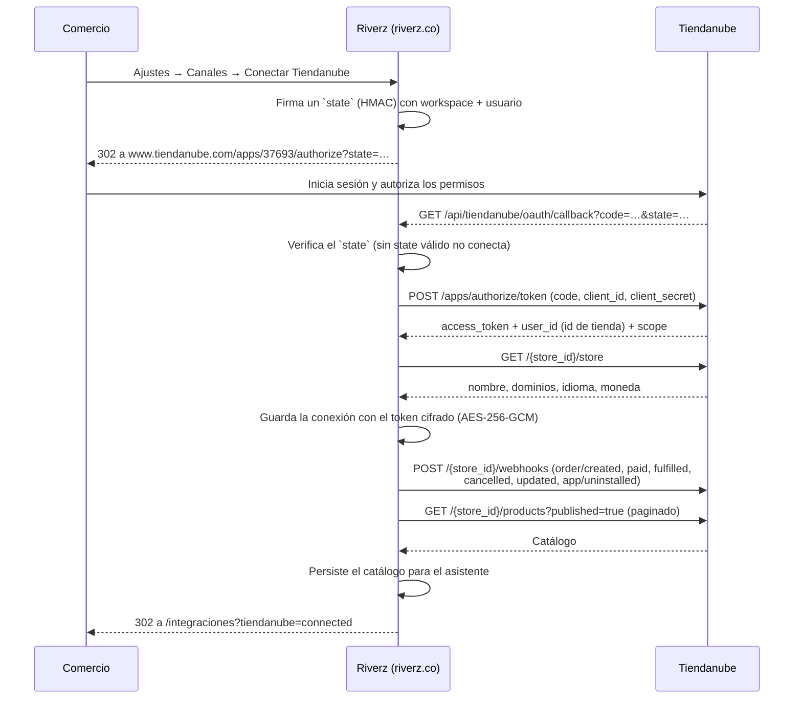
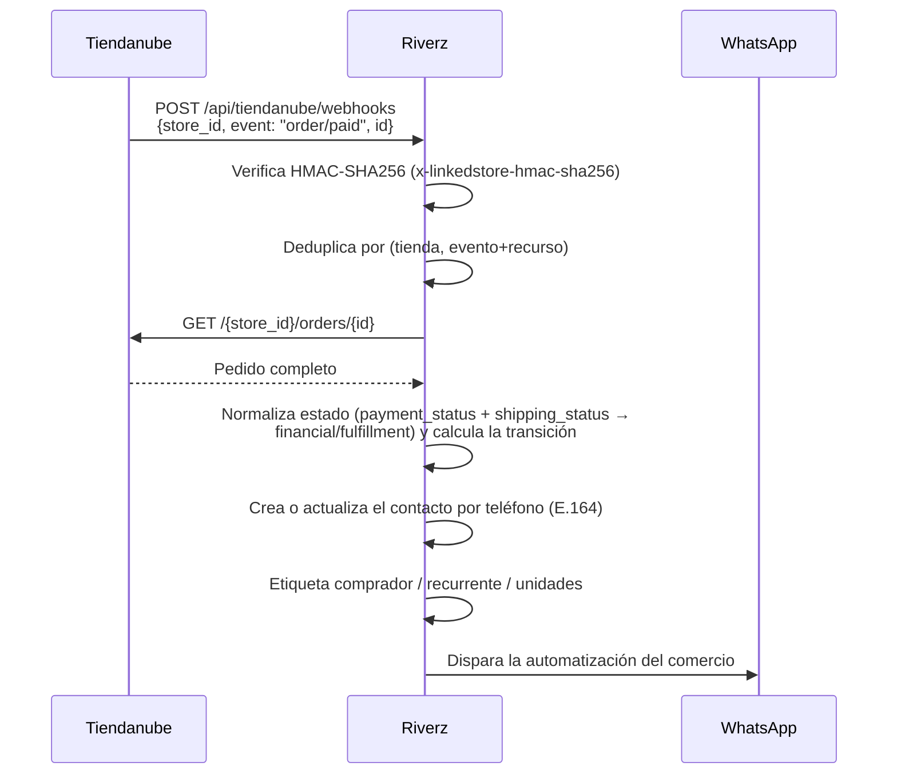
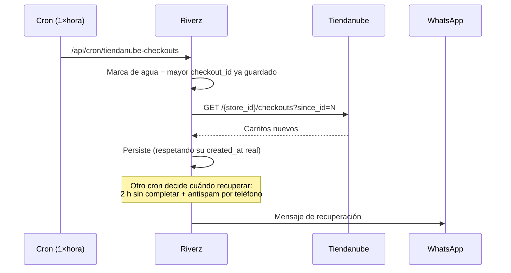
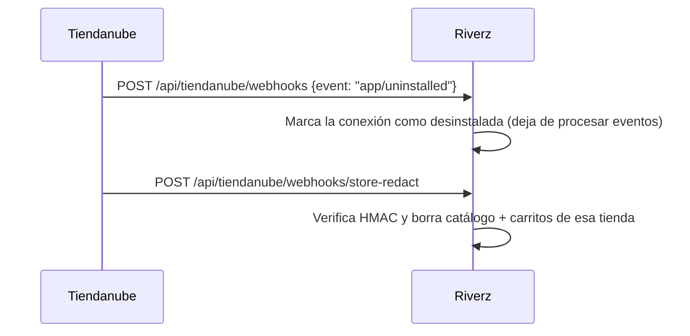

# App de Tiendanube

> **2026-08-15 — La homologación ya no hace falta.** La app pasó a
> distribución **"Para sus clientes"** ("Disponible para las tiendas
> escogidas por ti"), que según la documentación de Tiendanube **no
> requiere homologación**. Es lo que corresponde al modelo real: Riverz no
> se lista en la tienda de aplicaciones, se instala a los comercios que el
> dueño elige y se les cobra aparte.
>
> No hay ninguna lista de tiendas que anotar en el portal: al elegir esa
> opción el formulario no agrega ningún selector. "Las tiendas escogidas
> por ti" son, en la práctica, aquellas a las que le pases el enlace:
>
> ```
> https://www.tiendanube.com/apps/37693/authorize
> ```
>
> Verificado después del cambio, de punta a punta contra la tienda demo con
> la conexión borrada: instalación → cuenta → tienda conectada y activa.
>
> Todo lo que sigue —requisitos, guion de video, textos de la ficha— queda
> como expediente por si algún día se quiere publicar en la tienda de
> aplicaciones. Para el modelo actual no se usa.

## Respuesta de Tiendanube sobre el cambio de distribución (2026-08-16)

Jenn contestó el ticket `[6G0V9M-KMXGD]` y despeja el miedo que definía el
orden de trabajo:

> El enlace de instalación seguirá funcionando para comercios reales durante
> todo el proceso de revisión, sus clientes activos no se verán afectados y los
> datos que completen en la ficha no se perderán. No tendrán ninguna
> interrupción.
>
> Pueden preparar con calma toda la ficha de publicación. Una vez que esté
> lista, cambien la distribución a "Tienda de aplicaciones" y envíen la
> solicitud. Sus clientes actuales y los nuevos comercios podrán seguir
> instalando la app con normalidad durante todo el proceso.

O sea: **no hay ventana de apagón**. Cambiar el selector no corta el enlace que
hoy usan los comercios, y lo cargado en "Datos de publicación" no se pierde.
Cae la precaución de "cambiar el selector recién el día del envío": se puede
cambiar cuando convenga.

Aviso menor: el desglose punto por punto de esa respuesta llegó con las tres
viñetas vacías. La respuesta en prosa es inequívoca, pero si alguna vez hace
falta citar textualmente el punto 2 (reversibilidad del cambio), conviene
volver a preguntarlo antes de apoyarse en él.

## Estado al 2026-08-16 — publicar en la tienda de aplicaciones

Verificado en el portal (`applications/update/37693`): la distribución guardada
sigue siendo **privada** — el selector marca "Para sus clientes", no "Tienda de
aplicaciones". **El proceso público no está iniciado.**

**Sobre tocar el selector: ya no hay riesgo.** La precaución que estaba
anotada acá —que una app pública sin homologar solo se instala en tiendas
demo— quedó desmentida por Tiendanube el 2026-08-16: el enlace sigue
funcionando para comercios reales durante toda la revisión (ver la sección de
arriba). El orden sigue siendo juntar la ficha primero, pero por comodidad, no
porque cambiar antes rompa nada.

Decisiones del dueño (2026-08-16), que eran lo único que faltaba definir:

| Campo | Decisión |
| --- | --- |
| Forma de cobro | **Gratis** — la suscripción se contrata en riverz.co, fuera de Tiendanube |
| Países | **Cuatro**: Argentina, Chile, Colombia, México. Brasil queda para cuando exista `pt-BR` |

Assets y contenido, estado real:

| Pieza | Estado |
| --- | --- |
| Textos de la ficha (es) | Listos — sección 8 |
| Ícono 200 × 200 | Listo — `C:\tmp\tiendanube-ficha\icono-200.png` |
| 3–5 imágenes de 1920 × 1080 | **Listas** — 4 imágenes, ver 0.1 |
| Video de YouTube ≤ 3 min | **Listo** — ver 0.2 |
| Video demo de homologación | **Ya existía** — `out\tiendanube-homologacion-final.mp4`, 8 min 39 s, grabado el 2026-08-15 |
| Ficha en portugués | No aplica por ahora — Brasil queda fuera |

**Consulta respondida el 2026-08-16** en el ticket `[6G0V9M-KMXGD]`: sin
interrupción para los comercios conectados y sin pérdida de lo cargado en la
ficha. El detalle, arriba.

**Advertencia sobre Brasil.** La ficha brasileña se escribe en portugués, pero
la aplicación solo habla español e inglés: un comercio brasileño instalaría un
panel que no está en su idioma. Conviene publicar primero en Argentina, Chile,
Colombia y México, y sumar Brasil cuando exista el catálogo `pt-BR` en
`src/lib/i18n/messages/`.

### 0.1 Imágenes de la ficha — listas (2026-08-16)

En `C:\tmp\tiendanube-ficha\`, las cuatro a 1920 × 1080 exactos y por debajo de
200 KB:

| Archivo | Qué muestra |
| --- | --- |
| `1-bandeja-conversacion.png` | Una conversación de WhatsApp con el asistente respondiendo precio, envío y promoción |
| `2-canales.png` | Los doce canales de Integraciones en grilla |
| `3-contactos-etiquetas.png` | Contactos con etiquetas comprador / carrito-abandonado / unidades |
| `4-metricas.png` | Resumen con conversaciones, mensajes y volumen por canal |

Cómo se sacaron, por si hay que repetirlas:

- Desde la cuenta del revisor (`riverzoficial+tnreview@gmail.com`) y en un
  **contexto de navegador aislado** (`Target.createBrowserContext`), para no
  tocar la sesión del comercio real. Las capturas nunca salen del espacio de
  un cliente: ahí hay datos de personas reales.
- Con `Emulation.setDeviceMetricsOverride` en 1920 × 1080, que da el tamaño
  exacto que pide el formulario sin recortar después.
- Esperando a que **todas las imágenes terminen de cargar**
  (`document.images.every(i => i.complete)`), no solo a `readyState`. En la
  primera tanda los logos de los canales salieron como círculos blancos.

**Datos ficticios sembrados** en ese espacio para que las pantallas no salieran
vacías: 8 contactos, 6 conversaciones y 17 mensajes sobre el producto de la
tienda demo. Todos los ids empiezan con `dddddddd-`, así que se borran de una:

```sql
delete from messages where id::text like 'dddddddd-%';
delete from conversations where id::text like 'dddddddd-%';
delete from contacts where id::text like 'dddddddd-%';
```

Falta una quinta imagen posible: **Automatizaciones**, que hoy muestra "Conecta
un canal antes de automatizar" porque ese espacio no tiene ningún canal
conectado.

### 0.2 Video de la ficha — listo (2026-08-16)

`C:\tmp\screenplay\out\tiendanube-ficha-3min.mp4` — **1 min 53 s**, 1920 × 1080,
28 MB. Cinco escenas: la tienda conectada, el catálogo con el precio
promocional, la bandeja con el asistente respondiendo, los contactos
etiquetados y el resumen. Flow en `screenplay/flows/tiendanube-ficha-3min.json`.

Es **otro** video que el de homologación: aquel dura 8:39 y cubre los seis
escenarios que exige la revisión; este entra en el tope de 3 minutos del campo
de YouTube de la ficha. Falta subirlo como "no listado" y pegar el enlace.

Dos cosas que hubo que arreglar y conviene saber antes de repetirlo:

- **La tienda demo estaba atada a otro espacio.** Al abrir el enlace de
  autorización con el perfil de grabación logueado como
  `riverzoficial+clientedemo@gmail.com`, la instalación se ató a ESE espacio y
  el catálogo salía vacío en el del revisor. Se movieron la conexión y el
  producto al espacio del revisor.
- **`producir` no sirve en esta máquina** (ver la memoria de screenplay): hay
  que correr `scout`, matar el Chrome de `:9333` y recién entonces `ensayo` y
  `record`. Con el navegador vivo, la copia del perfil sale sin sesión.

---

Estado al 2026-07-27. La app existe y está configurada; falta la revisión
de Tiendanube para que la puedan instalar comercios reales.

| Dato | Valor |
| --- | --- |
| App ID | `37693` |
| Nombre | Riverz |
| Distribución | Pública (Tienda de aplicaciones) |
| Estado en el portal | En desarrollo |
| Correo de contacto | `riverzoficial@gmail.com` |
| Portal | https://partners.tiendanube.com/applications/details/37693 |
| Soporte de socios | socios@tiendanube.com |

URLs registradas:

- Página: `https://riverz.co`
- Redirect OAuth: `https://riverz.co/api/tiendanube/oauth/callback`
- `store/redact`: `https://riverz.co/api/tiendanube/webhooks/store-redact`
- `customers/redact`: `https://riverz.co/api/tiendanube/webhooks/customers-redact`
- `customers/data_request`: `https://riverz.co/api/tiendanube/webhooks/customers-data-request`

Permisos solicitados: `View Products`, `View Orders`, `Edit Orders`,
`View Customers`, `Read Content`. Deliberadamente NO pedimos `Edit
Products` ni los de `Orders Risk`: pedir permisos que la app no usa es de
lo primero que objeta una revisión.

---

## 1. Qué exige la homologación

Según `dev.tiendanube.com/docs/homologation/requirements`:

1. **Diagrama de secuencia** de la interacción con la API. → Sección 2.
2. **Video demo** completo; un video incompleto rechaza el proceso. → Sección 3.
3. **Cuenta demo liberada** de planes o etapas pagas. → Sección 4.
4. **NubeSDK** obligatorio para apps nuevas desde el 2026-06-05. → Sección 5.

---

## 2. Diagrama de secuencia

### 2.1 Instalación (OAuth)



El token es permanente: Tiendanube no expira los tokens, así que no hay
ciclo de refresh.

### 2.2 Pedidos (webhook)

Tiendanube manda solo `{ store_id, event, id }`, sin el recurso, así que
el receptor consulta el pedido por API. Es la diferencia con Shopify, que
manda el pedido entero firmado.



Usamos webhooks y no consultas periódicas justamente por el criterio de
uso eficiente de recursos que pide la homologación. La única excepción es
la sección siguiente.

### 2.3 Carritos abandonados (consulta periódica, por diseño de la plataforma)

Tiendanube no emite webhook de carrito abandonado, así que es el único
caso donde consultamos. Una vez por hora y con `since_id`, de modo que
cada corrida trae solo lo nuevo en lugar de repaginar los 30 días de
historial que la plataforma retiene.



### 2.4 Desinstalación y privacidad



`customers/redact` y `customers/data_request` se verifican y confirman sin
borrar: de un comprador puntual no guardamos nada indexable por su id de
Tiendanube — el contacto se crea a partir del teléfono y vive atado al
espacio de trabajo del comercio, no a la tienda.

Los tres fallan cerrado (503) si falta el secreto, en vez de aceptar sin
verificar. Un endpoint de borrado sin autenticar sería una vía para que un
tercero vacíe los datos de un comercio.

---

## 3. Guion del video demo

Un video incompleto rechaza el proceso, así que tiene que cubrir los seis
escenarios en una sola grabación continua.

1. **Instalación desde Tiendanube.** Abrir
   `https://www.tiendanube.com/apps/37693/authorize`, iniciar sesión con
   la tienda demo, mostrar la pantalla de permisos y aceptar. Mostrar el
   regreso a Riverz con la tienda ya conectada.
2. **Registro de un usuario nuevo.** Crear una cuenta Riverz desde cero y
   conectar la tienda desde Ajustes → Canales → Tiendanube.
3. **Ingreso de un usuario existente.** Cerrar sesión, volver a entrar y
   mostrar que la tienda sigue conectada.
4. **Reinstalación.** Desconectar desde Riverz, repetir el flujo de
   autorización y mostrar que no se duplica la conexión.
5. **Funcionalidad principal.** Crear un pedido en la tienda demo y
   mostrar el mensaje de WhatsApp que dispara. Después, dejar un carrito
   sin completar y mostrar la recuperación.
6. **Configuración técnica para el comercio.** Recorrer Ajustes → Canales,
   el sincronizado del catálogo y cómo se desconecta.

Cubrir además cada escenario del diagrama de la sección 2 con los permisos
otorgados.

---

## 4. Cuenta demo para la revisión

Riverz no tiene etapas pagas ni muro de suscripción hoy, así que no hay
nada que liberar: la cuenta que se entregue funciona completa desde el
primer minuto. Si se agrega un plan pago antes de la revisión, hay que
crear una cuenta exenta y avisarlo en la solicitud.

- **Tienda demo de Tiendanube:** "Riverz Demo" (Colombia, tienda
  `#8018159`, dominio `riverzdemo.mitiendanube.com`), creada el
  2026-07-27. Usuario `riverzoficial+tndemo@gmail.com`. El acceso al
  administrador NO es por `tiendanube.com/login` —ese correo no está
  registrado como login— sino por el enlace SSO del portal de socios:
  Tiendas → Riverz Demo → "Administrar tienda".
- **Cuenta Riverz para el revisor:** `riverzoficial+tnreview@gmail.com`,
  creada el 2026-07-27. Espacio de trabajo limpio, con la tienda demo ya
  conectada. Las contraseñas están fuera de este archivo.

## 4.1 Instalación verificada de punta a punta

Ejecutada el 2026-07-28 contra la tienda demo, con el código en
producción (`riverz.co`). Lo que quedó comprobado:

| Paso | Resultado |
| --- | --- |
| Redirección a `tiendanube.com/apps/37693/authorize` | El `state` firmado sobrevive el ida y vuelta |
| Canje del código y persistencia | Conexión `active`, método `oauth` |
| Lectura de `/store` | Nombre "Riverz Demo", dominio y moneda `COP` correctos |
| Alta de webhooks | Sin errores en los registros del servidor |
| Sincronización de catálogo | 1 producto, con nombre localizado aplanado y URL bien armada |
| Precio efectivo | Con lista 89.000 y promocional 69.000, el catálogo guarda **69.000** — el agente cotiza lo que el cliente paga |

Nota de la prueba: el asistente de alta de la tienda demo (encuesta de
onboarding) se interpone la primera vez y hay que completarlo antes de
que la pantalla de autorización aparezca. Conviene dejarlo hecho antes de
grabar el video.

---

## 5. NubeSDK — punto a resolver antes de enviar

Desde el 2026-06-05 la documentación dice que las solicitudes nuevas no se
aprueban sin adecuación a NubeSDK, y que los modelos anteriores
(`document`, `window`, jQuery, manipulación directa del DOM) ya no pasan.

**No está claro que aplique a esta app**, y conviene resolverlo antes de
invertir en el video:

- NubeSDK está pensado para apps que renderizan interfaz dentro de las
  superficies de Tiendanube (pestaña en el administrador, scripts en la
  tienda). Corre en web workers aislados, sin acceso al DOM.
- Riverz no renderiza nada dentro de Tiendanube: es una integración de
  servidor por OAuth, con su propio panel en `riverz.co`. La casilla
  "Integrar en el administrador de tiendas" está desmarcada y no
  registramos ningún Script. No hay DOM que migrar.
- El SDK está **en fase beta** y la propia documentación pide contactar al
  equipo antes de integrarlo.

**Acción:** escribir a socios@tiendanube.com preguntando si una app sin
interfaz embebida necesita adecuación a NubeSDK. Si la respuesta es que
sí, implica construir una superficie embebida que hoy no existe, y eso
cambia el tamaño del trabajo.

---

## 5.1 Pedido real: webhook verificado (2026-08-14)

Se compró en la tienda demo desde el navegador, como lo haría un cliente:
pedido **#100** (`2045729799`), Serum Vitamina C, COP 69.000.

| Comprobación | Resultado |
| --- | --- |
| Entrega del webhook | El portal (Aplicaciones → Logs) registra `Webhook delivered successfully to https://riverz.co/api/tiendanube/webhooks — 200 — 929 ms` |
| Firma HMAC | Verificada: el handler siguió más allá del 401 |
| Lectura del pedido por API | Hecha: el handler resuelve el recurso porque el cuerpo no lo trae |
| Alta en `shopify_order_fulfillment_state` | Fila del pedido creada — el claim de `order/created` funcionó |
| Disparo de automatización | **No**, terminó en `no_phone` |

Dos configuraciones de la tienda demo faltaban y se corrigieron:

- **No había ningún medio de pago activo**, así que el checkout mostraba
  "No encontramos ninguna opción de pago disponible" y no dejaba cerrar la
  compra. Se activó el pago personalizado **"A convenir"**.
- **El checkout no pedía teléfono**, y sin teléfono la ingesta corta en
  `no_phone`: espeja el pedido pero no crea contacto ni dispara nada. Se
  activó "Pedir teléfono de contacto" en Configuración → Opciones del
  checkout. Sin esto, la escena de funcionalidad del video no tiene
  mensaje de WhatsApp que mostrar.

## 6. Estado del checklist

| Requisito | Estado |
| --- | --- |
| App creada y configurada en el portal | Hecho |
| URLs de OAuth y privacidad registradas | Hecho |
| Permisos declarados (mínimos necesarios) | Hecho |
| Endpoints en producción, verificados | Hecho |
| Tienda demo creada | Hecho |
| Diagrama de secuencia | Hecho (sección 2) |
| Instalación probada de punta a punta | Hecho (sección 4.1) |
| Cuenta Riverz para el revisor | Hecho |
| Webhook de pedido recibido con un pedido real | Hecho (sección 5.1) |
| Datos básicos en el portal | Hecho |
| **Datos de publicación en el portal** | **Pendiente — es lo que traba el botón** |
| Video demo | Pendiente (guion en la sección 3) |
| Definición sobre NubeSDK | Consultada a socios@tiendanube.com |

## 6.1 Instalación desde Tiendanube — resuelta (2026-08-15)

Faltaba el escenario que la homologación pide primero y textual:
*"instalación de la app desde Nuvemshop y **no** desde el panel de la
app"*. No era un problema de cómo grabar el video: el callback exigía un
`state` firmado que sólo emite nuestro propio botón, así que **cualquier
comercio que llegara desde la tienda de aplicaciones moría** en
`/integraciones?tiendanube=error&reason=invalid_state`.

El callback ahora distingue los dos orígenes, y se agregó el camino
"instalar primero, reclamar después" que ya existía para Shopify
(migración 149, que generaliza la tabla de la 101):

| Origen | Qué pasa |
| --- | --- |
| Desde Riverz | El `state` firmado dice a qué workspace atar la tienda. Igual que antes. |
| Desde Tiendanube, comercio sin cuenta | Se canjea el código, el token se estaciona cifrado, el navegador se lleva un token de reclamo de un solo uso, y el panel ata la tienda apenas el comercio entra. |
| Desde Tiendanube, tienda ya conocida | Reinstalación: se vuelve a atar a su dueño de siempre, sin pasar por el reclamo. |

Probado de punta a punta el 2026-08-15 contra la tienda demo, borrando
antes su conexión para simular un comercio que nunca la instaló:

| Paso | Resultado |
| --- | --- |
| `tiendanube.com/apps/37693/authorize` | Muestra "Instalar Riverz" con la lista de permisos |
| Aceptar | Redirige a `riverz.co/ingresar?tiendanube=pending` |
| Instalación estacionada | Fila en `shopify_pending_installs` con el scope completo y el token cifrado |
| Ingreso del comercio | El panel reclama sola la tienda |
| Conexión final | `active`, dominio real `riverzdemo.mitiendanube.com`, fila pendiente consumida |

## 7. Lo que realmente traba el envío

El botón **"Solicitar homologación"** vive en la pestaña Configuración de la
app y está bloqueado con el mensaje "Completa los formularios de datos
básicos y de publicación". Datos básicos figura *Finalizada*; **Datos de
publicación figura *Pendiente***. Ese formulario pide:

1. **URLs**: de configuraciones, de política de privacidad, de soporte, y un
   e-mail de soporte. El handle ya está tomado como `riverz`.
2. **Por país** (Argentina, Brasil, Chile, Colombia, México), y cada uno por
   separado:
   - Forma de cobro: gratis, pago único o mensual recurrente.
   - Descripción breve (≤140 caracteres) y descripción larga (≤2000).
   - Ícono de **exactamente 200 × 200 px**, hasta 400 KB.
   - Entre **3 y 5 imágenes de exactamente 1920 × 1080 px**, hasta 5 MB.
   - Video de YouTube de hasta 3 minutos y hasta 10 preguntas frecuentes.

De esto, lo único que no se puede escribir sin una decisión del dueño es la
forma de cobro y en qué países se publica.

---

## 8. Textos listos para pegar en Datos de publicación

Escritos para pegarse tal cual. Respetan los límites del formulario y la
regla de Tiendanube de no usar emojis.

### URLs

| Campo | Valor |
| --- | --- |
| URL de configuraciones | `https://riverz.co/integraciones` |
| URL de política de privacidad | `https://riverz.co/privacidad` |
| URL de soporte | `https://riverz.co/soporte` |
| E-mail de soporte | `riverzoficial@gmail.com` |
| Handle | `riverz` (ya cargado) |

### Descripción breve (132 de 140 caracteres)

> Conecta tu tienda con WhatsApp: recupera carritos abandonados, avisa cada
> pedido y responde con un asistente que conoce tu catálogo.

### Descripción larga (1.184 de 2.000 caracteres)

> Riverz junta WhatsApp, Instagram, Messenger y tu correo en una sola
> bandeja, y los conecta con lo que pasa en tu tienda.
>
> Qué hace con los datos de tu tienda:
>
> - Carrito abandonado. Si alguien deja la compra a medias, Riverz le
>   escribe a las dos horas con el link para terminarla.
> - Aviso de cada pedido. Confirmación al comprar, aviso al despachar y
>   seguimiento al entregar, sin copiar y pegar nada.
> - Catálogo al día. Tus productos, precios y promociones se sincronizan
>   solos. El asistente cotiza el precio que paga el cliente, no el de
>   lista.
> - Clientes ordenados. Cada comprador entra con su teléfono, lo que
>   compró y una etiqueta que lo separa de quien todavía no compró.
> - Asistente con IA. Responde dudas de envíos, precios y disponibilidad
>   con la información real de tu tienda, a cualquier hora.
> - Campañas. Mandas una promoción a un segmento y ves quién abrió, quién
>   respondió y quién compró.
>
> Cómo empezar:
>
> 1. Instala Riverz desde la tienda de aplicaciones.
> 2. Entra o crea tu cuenta. Tu tienda queda conectada sola.
> 3. Conecta tu WhatsApp y elige qué avisos quieres mandar.
>
> No hay que programar nada ni tocar el diseño de tu tienda.

### Preguntas frecuentes

1. **¿Necesito saber programar?** No. Se instala desde la tienda de
   aplicaciones y el catálogo se sincroniza solo.
2. **¿Qué datos de mi tienda lee Riverz?** Productos, pedidos, clientes y
   páginas de contenido. Puede cambiar pedidos para reflejar lo que se
   acuerda por chat. Nada más.
3. **¿Sirve si vendo por Instagram además de la tienda?** Sí. Instagram,
   Messenger, WhatsApp y correo llegan a la misma bandeja, con el
   historial de compras de cada persona al lado.
4. **¿Cómo recupera un carrito abandonado?** Riverz revisa cada hora los
   carritos sin terminar y, a las dos horas, le escribe a quien dejó su
   teléfono con el link para completar la compra.
5. **¿El asistente inventa precios?** No. Cotiza con el catálogo
   sincronizado, y usa el precio promocional cuando existe.
6. **¿Puedo desinstalarla cuando quiera?** Sí, desde Mis aplicaciones o
   desde el propio panel de Riverz. Al desinstalar dejamos de procesar
   los eventos de tu tienda.
7. **¿Necesito un WhatsApp aparte?** Necesitas un número que puedas usar
   con WhatsApp Business. Riverz te guía para conectarlo.

### Lo que sigue faltando

- **Ícono de 200 × 200 px** y **entre 3 y 5 imágenes de 1920 × 1080 px**.
- **Forma de cobro** (gratis / pago único / mensual) y **en qué países**
  se publica. Decisión del dueño.
- **Saldo en Anthropic.** La descripción menciona el asistente con IA; si
  un revisor lo prueba con la cuenta sin saldo, no responde.
