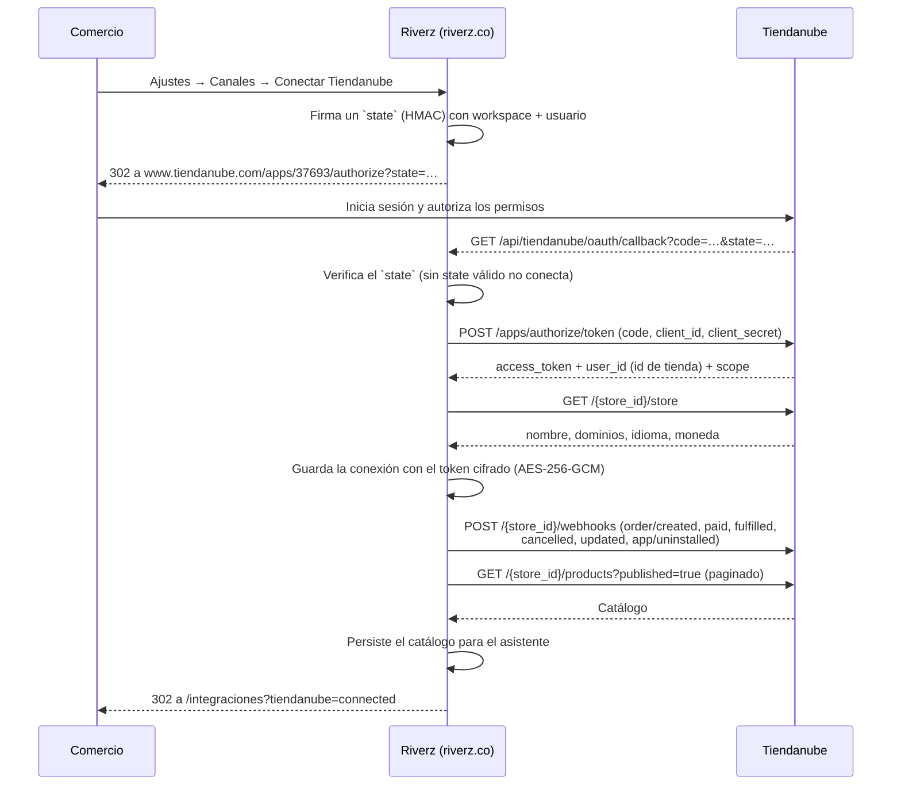
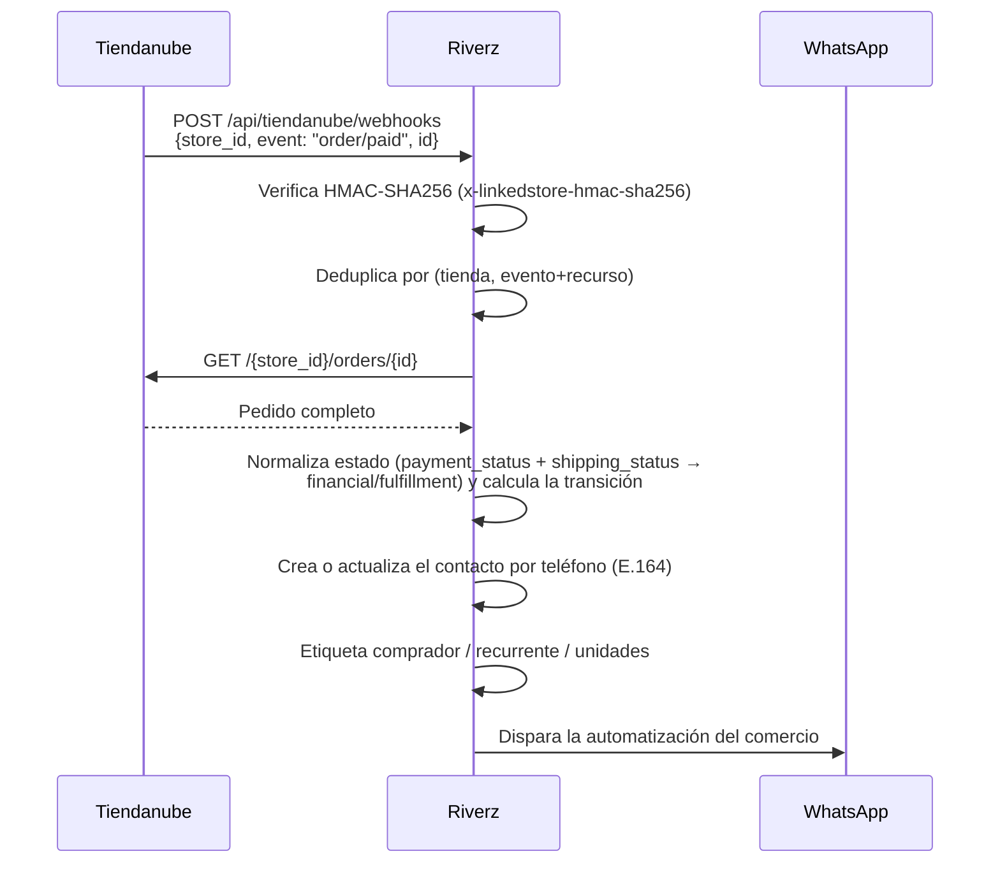
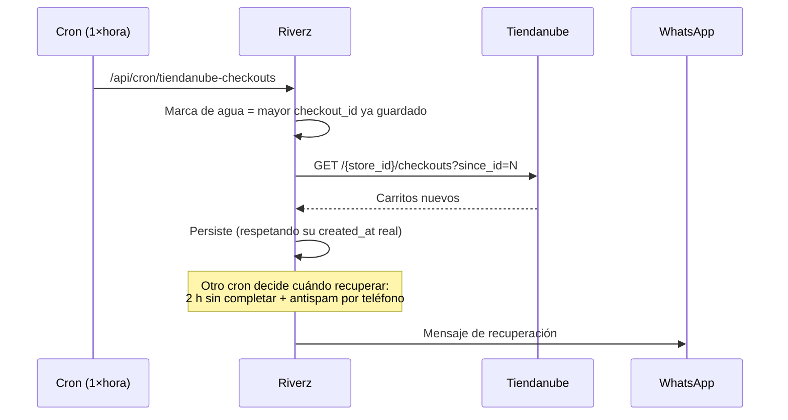
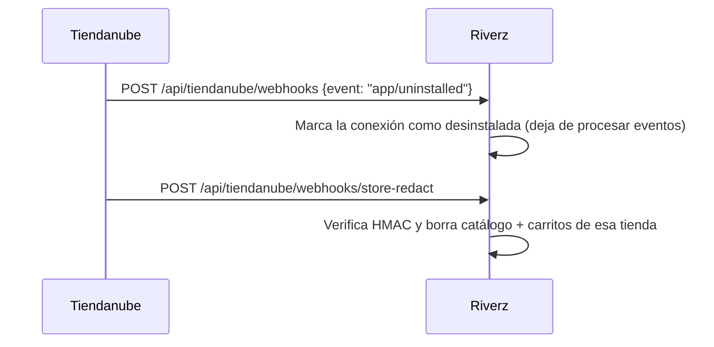

# Homologación de la app de Tiendanube

Estado al 2026-07-27. La app existe y está configurada; falta la revisión
de Tiendanube para que la puedan instalar comercios reales.

| Dato | Valor |
| --- | --- |
| App ID | `37693` |
| Nombre | Riverz |
| Distribución | Pública (Tienda de aplicaciones) |
| Estado en el portal | En desarrollo |
| Correo de contacto | `riverzoficial@gmail.com` |
| Portal | https://partners.tiendanube.com/applications/details/37693 |
| Soporte de socios | socios@tiendanube.com |

URLs registradas:

- Página: `https://riverz.co`
- Redirect OAuth: `https://riverz.co/api/tiendanube/oauth/callback`
- `store/redact`: `https://riverz.co/api/tiendanube/webhooks/store-redact`
- `customers/redact`: `https://riverz.co/api/tiendanube/webhooks/customers-redact`
- `customers/data_request`: `https://riverz.co/api/tiendanube/webhooks/customers-data-request`

Permisos solicitados: `View Products`, `View Orders`, `Edit Orders`,
`View Customers`, `Read Content`. Deliberadamente NO pedimos `Edit
Products` ni los de `Orders Risk`: pedir permisos que la app no usa es de
lo primero que objeta una revisión.

---

## 1. Qué exige la homologación

Según `dev.tiendanube.com/docs/homologation/requirements`:

1. **Diagrama de secuencia** de la interacción con la API. → Sección 2.
2. **Video demo** completo; un video incompleto rechaza el proceso. → Sección 3.
3. **Cuenta demo liberada** de planes o etapas pagas. → Sección 4.
4. **NubeSDK** obligatorio para apps nuevas desde el 2026-06-05. → Sección 5.

---

## 2. Diagrama de secuencia

### 2.1 Instalación (OAuth)

El token es permanente: Tiendanube no expira los tokens, así que no hay
ciclo de refresh.

### 2.2 Pedidos (webhook)

Tiendanube manda solo `{ store_id, event, id }`, sin el recurso, así que
el receptor consulta el pedido por API. Es la diferencia con Shopify, que
manda el pedido entero firmado.

Usamos webhooks y no consultas periódicas justamente por el criterio de
uso eficiente de recursos que pide la homologación. La única excepción es
la sección siguiente.

### 2.3 Carritos abandonados (consulta periódica, por diseño de la plataforma)

Tiendanube no emite webhook de carrito abandonado, así que es el único
caso donde consultamos. Una vez por hora y con `since_id`, de modo que
cada corrida trae solo lo nuevo en lugar de repaginar los 30 días de
historial que la plataforma retiene.

### 2.4 Desinstalación y privacidad

`customers/redact` y `customers/data_request` se verifican y confirman sin
borrar: de un comprador puntual no guardamos nada indexable por su id de
Tiendanube — el contacto se crea a partir del teléfono y vive atado al
espacio de trabajo del comercio, no a la tienda.

Los tres fallan cerrado (503) si falta el secreto, en vez de aceptar sin
verificar. Un endpoint de borrado sin autenticar sería una vía para que un
tercero vacíe los datos de un comercio.

---

## 3. Guion del video demo

Un video incompleto rechaza el proceso, así que tiene que cubrir los seis
escenarios en una sola grabación continua.

1. **Instalación desde Tiendanube.** Abrir
   `https://www.tiendanube.com/apps/37693/authorize`, iniciar sesión con
   la tienda demo, mostrar la pantalla de permisos y aceptar. Mostrar el
   regreso a Riverz con la tienda ya conectada.
2. **Registro de un usuario nuevo.** Crear una cuenta Riverz desde cero y
   conectar la tienda desde Ajustes → Canales → Tiendanube.
3. **Ingreso de un usuario existente.** Cerrar sesión, volver a entrar y
   mostrar que la tienda sigue conectada.
4. **Reinstalación.** Desconectar desde Riverz, repetir el flujo de
   autorización y mostrar que no se duplica la conexión.
5. **Funcionalidad principal.** Crear un pedido en la tienda demo y
   mostrar el mensaje de WhatsApp que dispara. Después, dejar un carrito
   sin completar y mostrar la recuperación.
6. **Configuración técnica para el comercio.** Recorrer Ajustes → Canales,
   el sincronizado del catálogo y cómo se desconecta.

Cubrir además cada escenario del diagrama de la sección 2 con los permisos
otorgados.

---

## 4. Cuenta demo para la revisión

Riverz no tiene etapas pagas ni muro de suscripción hoy, así que no hay
nada que liberar: la cuenta que se entregue funciona completa desde el
primer minuto. Si se agrega un plan pago antes de la revisión, hay que
crear una cuenta exenta y avisarlo en la solicitud.

- **Tienda demo de Tiendanube:** "Riverz Demo" (Colombia, tienda
  `#8018159`, dominio `riverzdemo.mitiendanube.com`), creada el
  2026-07-27. Usuario `riverzoficial+tndemo@gmail.com`. El acceso al
  administrador NO es por `tiendanube.com/login` —ese correo no está
  registrado como login— sino por el enlace SSO del portal de socios:
  Tiendas → Riverz Demo → "Administrar tienda".
- **Cuenta Riverz para el revisor:** `riverzoficial+tnreview@gmail.com`,
  creada el 2026-07-27. Espacio de trabajo limpio, con la tienda demo ya
  conectada. Las contraseñas están fuera de este archivo.

## 4.1 Instalación verificada de punta a punta

Ejecutada el 2026-07-28 contra la tienda demo, con el código en
producción (`riverz.co`). Lo que quedó comprobado:

| Paso | Resultado |
| --- | --- |
| Redirección a `tiendanube.com/apps/37693/authorize` | El `state` firmado sobrevive el ida y vuelta |
| Canje del código y persistencia | Conexión `active`, método `oauth` |
| Lectura de `/store` | Nombre "Riverz Demo", dominio y moneda `COP` correctos |
| Alta de webhooks | Sin errores en los registros del servidor |
| Sincronización de catálogo | 1 producto, con nombre localizado aplanado y URL bien armada |
| Precio efectivo | Con lista 89.000 y promocional 69.000, el catálogo guarda **69.000** — el agente cotiza lo que el cliente paga |

Nota de la prueba: el asistente de alta de la tienda demo (encuesta de
onboarding) se interpone la primera vez y hay que completarlo antes de
que la pantalla de autorización aparezca. Conviene dejarlo hecho antes de
grabar el video.

---

## 5. NubeSDK — punto a resolver antes de enviar

Desde el 2026-06-05 la documentación dice que las solicitudes nuevas no se
aprueban sin adecuación a NubeSDK, y que los modelos anteriores
(`document`, `window`, jQuery, manipulación directa del DOM) ya no pasan.

**No está claro que aplique a esta app**, y conviene resolverlo antes de
invertir en el video:

- NubeSDK está pensado para apps que renderizan interfaz dentro de las
  superficies de Tiendanube (pestaña en el administrador, scripts en la
  tienda). Corre en web workers aislados, sin acceso al DOM.
- Riverz no renderiza nada dentro de Tiendanube: es una integración de
  servidor por OAuth, con su propio panel en `riverz.co`. La casilla
  "Integrar en el administrador de tiendas" está desmarcada y no
  registramos ningún Script. No hay DOM que migrar.
- El SDK está **en fase beta** y la propia documentación pide contactar al
  equipo antes de integrarlo.

**Acción:** escribir a socios@tiendanube.com preguntando si una app sin
interfaz embebida necesita adecuación a NubeSDK. Si la respuesta es que
sí, implica construir una superficie embebida que hoy no existe, y eso
cambia el tamaño del trabajo.

---

## 6. Estado del checklist

| Requisito | Estado |
| --- | --- |
| App creada y configurada en el portal | Hecho |
| URLs de OAuth y privacidad registradas | Hecho |
| Permisos declarados (mínimos necesarios) | Hecho |
| Endpoints en producción, verificados | Hecho |
| Tienda demo creada | Hecho |
| Diagrama de secuencia | Hecho (sección 2) |
| Instalación probada de punta a punta | Hecho (sección 4.1) |
| Cuenta Riverz para el revisor | Hecho |
| Webhook de pedido recibido con un pedido real | Pendiente |
| Video demo | Pendiente (guion en la sección 3) |
| Definición sobre NubeSDK | **Pendiente — bloquea el envío** |
